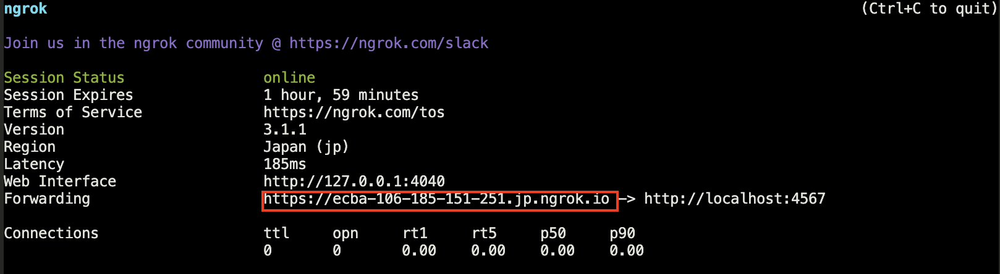
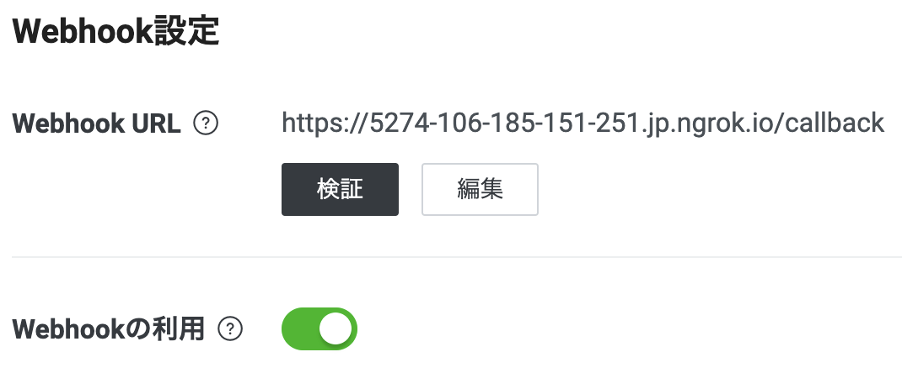

# インターンシップ(2days) LINE bot作成講座資料
LINE botのサンプルをローカルマシンで動かす方法をまとめています。  
プログラミング言語は[Ruby](https://www.ruby-lang.org/ja/)を使っています。  
`app.rb`は、[LINE Messaging API SDK for Ruby](https://github.com/line/line-bot-sdk-ruby)の[Synopsis](https://github.com/line/line-bot-sdk-ruby#synopsis)のまんまです。


# 概要


# Installing / Getting started
## [Ruby](https://www.ruby-lang.org/ja/)
今回初めてRubyを使う人は、Rubyの環境構築から行います。  
一派的にrubyはrbenvで管理する方法が知られています。 
詳しくは[この記事](https://nishinatoshiharu.com/manage-ruby-with-rbenv/)などを参照するといいと思います。   
あらかじめ[Homebrew](https://brew.sh/index_ja)がインストールされている必要があります。
```shell
# rbenvをbrewでインストール
$ brew update
$ brew install rbenv

# 確認（下記コマンドが通ればインストールはOK）
$ rbenv versions

# シェルの設定ファイル（.bashrcや.zshrc）に「eval "$(rbenv init -)"」を追加
$ vim ~/.zshrc
　→ eval "$(rbenv init -)" を追加

# sourceコマンドでシェルの設定を読み込み直す
$ source ~/.zshrc

# which rubyでrbenv配下のrubyが参照されていればOK
$ which ruby

# rbenv管理下にRubyをインストール
$ rbenv install -l # インストール可能なバージョンの一覧を確認
$ rbenv install 3.2.0 # バージョンを指定してRubyをインストールする
```

## [Ngrok](https://ngrok.com/)の導入、実行
ローカルサーバーで動かせるよう、Ngrokを導入します。
```shell
# Ngrokをインストール
brew install ngrok/ngrok/ngrok
# 確認('Ctrl + C'で停止)
ngrok http 4567
```

## プロジェクトの準備
1. 任意のディレクトリにこのリポジトリを clone してください。
2. clone したディレクトリに移動する  
    ```shell
    $ cd [任意のディレクトリ]/linebot-sample-ruby
    ```
3. このプロジェクトで使用する Ruby のバージョンを指定してください。
    ```shell
    $ rbenv local 3.2.0
    $ rbenv version # 確認
    ```
4. Bundler を使って gem をローカルにインストールしてください。
    ```shell
    $ bundle install --path=vendor/bundle
    $ bundle list # 確認  
    ```

## [LINE Developers](https://developers.line.biz/ja/)準備
LINE APIを使用するために、LINE Developersに設定が必要です。
<details><summary>LINE Developersコンソールにログインする</summary>
  
1. [LINE Developersコンソール](https://developers.line.biz/console/)に各自のLINEアカウントでログインしてください。  

2. 開発者として登録する（初回ログイン時のみ）
LINE Developersコンソールへの初回ログイン時は、開発者アカウントを作成する必要があります。

詳しくは、[LINE Developersコンソールへのログイン](https://developers.line.biz/ja/docs/line-developers-console/login-account/)を参照してください。
</details>

<details><summary>Messaging API チャネルの作成</summary>
  
1. [新規プロバイダーを作成する](https://developers.line.biz/ja/docs/messaging-api/getting-started/#step-three-create-new-provider)    
プロバイダーとは、アプリを提供する組織のことです。  
コンソール（ホーム）画面の`新規プロバイダー作成`をクリックするか、プロバイダーを既に作成済みの場合は、`プロバイダー`セクションの`作成`をクリックして別のプロバイダーを作成してください。

2. [チャネルを作成する](https://developers.line.biz/ja/docs/messaging-api/getting-started/#step-four-create-channel)  
作成したプロバイダーページで、`チャネル設定`タブの`Messaging API`をクリックしてください。

詳しくは、[Messaging APIを始めよう](https://developers.line.biz/ja/docs/messaging-api/getting-started/)を参照してください。

</details>

<details><summary>友達追加</summary>
  
  `Messaging API設定`タブの`ボット情報`セッションにQRコードがあるので、スキャンして友だち登録しておいてください。
</details>

<details><summary>「応答メッセージ」と「あいさつメッセージ」の設定</summary>
  
`Messaging API設定`タブの`LINE公式アカウント機能`セッションで`応答メッセージ`と`あいさつメッセージ`を`無効`に設定してください。  
Messaging APIを使うときは、これの設定が`無効`である必要があります。
</details>

<details><summary>チャネルアクセストークンの発行</summary>
  
`Messaging API設定`タブ最下部の`チャネルアクセストークン`セッションで、チャネルアクセストークンを発行してください。
</details>


# [ボットを作成する](https://developers.line.biz/ja/docs/messaging-api/building-bot/)
ボットアプリには、APIを呼び出すための`チャネルアクセストークン`と、LINEプラットフォームからWebhookペイロードを受け取るための`Webhook URL`が必要です。  

## LINEBotのデータをdotenvで設定する
`.env`ファイルでLINEBotのデータを宣言してください。
```
LINE_CHANNEL_ID = [チャネル基本設定/基本情報/チャネルID]
LINE_CHANNEL_SECRET = [チャネル基本設定/基本情報/チャネルシークレット]
LINE_CHANNEL_TOKEN = [先ほど発行したチャネルアクセストークン]
```

## [Sinatra](https://sinatrarb.com/) + [Ngrok](https://ngrok.com/) で動かす
```shell
# 特に指定しなければ Port 4567 で起動する（ターミナル1）
$ bundle exec ruby app.rb

# Sinatra のポート番号に合わせて ngrok を起動する（ターミナル2）
$ ngrok http 4567
```

## [Webhook URLを設定する](https://developers.line.biz/ja/docs/messaging-api/building-bot/#setting-webhook-url)

1. 先ほどNgorkに払い出された`Forwarding`のURLをコピーしてください。 

例: <https://ecba-106-185-151-251.jp.ngrok.io/callback>  
`.ngrok.io`より前の部分は`ngrok http 4567`の都度変わります。

2. `Messaging API設定`タブの`Webhook URL`セッションで
`1でコピーしたURL + /callback`を指定してください。  

`検証`をクリックして`成功`が返ってきたらOK。
また、この時`Webhookの利用`が`ON`に設定してください。

もしWebhook settingsの`検証`がうまくいかない場合は、ブラウザで`http://127.0.0.1:4567/`や`http://127.0.0.1:4567/inoki-says`にアクセスしてみてください。ここにアクセスできない場合はどこかで間違っています。なにかヒントが見つかるかも知れませんので迷わずアクセスしてみてください。

## LINEでテスト
ここまでできたら、オウム返しのLINEBotができているはずです。


# WindowsにインストールしたRubyで直接動かす
[WindowsのRubyのインストール手順](https://web-camp.io/magazine/archives/15051#Wtejyunn)などを参考に、Windowsに[Ruby Installer](https://rubyinstaller.org/)をインストールして演習を行なってください。  
Ngorkは[この記事](https://note.com/code82/n/nc805dca1da33)などを参考に導入してください。


# Links
- [Messaging API - LINE Developers](https://developers.line.biz/ja/docs/messaging-api/)
- [line/line-bot-sdk-ruby: LINE Messaging API SDK for Ruby - GitHub](https://github.com/line/line-bot-sdk-ruby)
- [Sinatra: Sinatra is a DSL for quickly creating web applications in Ruby with minimal effort](http://sinatrarb.com/)
- [ngrok - secure introspectable tunnels to localhost](https://ngrok.com/)